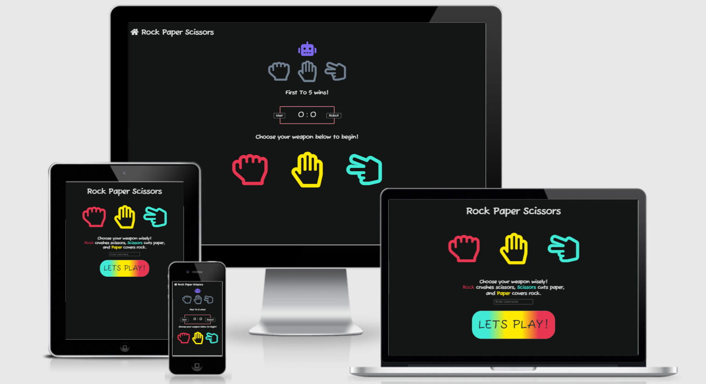

# Rock Paper Scissors

## Link to the deployed site

[Link to the deployed site](https://seantangney.github.io/my_full_template/)

## Some pictures of the finished site
### Landing page

### Game Page

# User Experience (UX)
- First time visitor Goals
    - As a first time visitor, I want to instantly understand the purpose of the site.
    - As a first time visitor, I want to be able to easily navigate through the site.
    - As a first time visitor, I want the game to be fun.

- Returning / Frequent user goals
    - As a returning / frequent user, I want to be able to come back and play again.

## Target Audience
Rock Paper Scissors is a classic game and this site is made for everyone, to have fun!

## The features i wanted my project to have are

- Create a username
- Scoretracking system
- Provide feedback to the user after input
- Provide feedback on the result of the game
- Easy to navigate
- Feel fun to be on the site through colour and interactivity

# Design
## Color Scheme
- The main colors i used were pink, yellow and light blue for the Font Awesome icons. I chose these "Pastel" inspired colours because i knew they would look nice with a text-shadow effect when hovered over them. 

## Fonts
- The primary font used was Fuzzy Bubbles with a fallback of Garamond in case the fonnt isn't imported into the site correctly. Fuzzy Bubbles is an attractive, fun font.

## Imagery
- I chose to use font awesome icons instead of images in this site as i feel like icons are more suited to the nature of this game. 

## Wireframes
### Landing page

### Game Page

# Features

### Responsive on All Devices - I used am i responsive to check this along with checking on a variety of devices myself.

## Has interactive features
### Landing Page
-   Username is required to be able to use the Lets play button.
-   The Lets play button has a hover feature where it inverts its colours.
### Game Page
-   The colorful Rock, Paper and scissors icons on the bottom of the page have a hover effect which will display them as glowing neon icons. I found this great tutorial on [CSS Tricks](https://css-tricks.com/how-to-create-neon-text-with-css/) 
-   The scoreboard updates live to the current score of the game as you play.
-   When rock paper or scissors is selected, you get feedback on what the computer/robot has selected too. This happens in two form, the robots selected icon will light up for 2 seconds and turn off again. There will be a little written description of what you picked and what the robot picked and the result of that round.
- There is a home button on the top left corner of the header to take you back to the landing page. This also lightly glows as you hover over it staying consistent with the rest of the site.
- I have a fun cursor follower animation for the game page. It adds to the "game feel". I found this cool animation on [CodePen](https://codepen.io/morphed/pen/LZWppE).

# Technolies Used
## Languages Used
- HTML5
- CSS3
- Javascript

## Frameworks, Libraries and Programs Used

- [Bootstrap](https://getbootstrap.com/docs/4.4/getting-started/introduction/) 
    - Bootstrap was used to assist with the responsiveness and styling of the website.

- [Hover.css](https://ianlunn.github.io/Hover/)
    - Hover was used multiple times throughout the site to add a fun feeling to the game and offer more site feedback to the user.

- [Google Fonts](https://fonts.google.com/)
    - Google fonts was used on this site to import the font 'Fuzzy Bubbles'.

- [Font Awesome](https://fontawesome.com/)
    - Font awesome was used on this site for the game icons and the home button.

- [Git](https://git-scm.com/)
    - Git was used for version control by utilizing the Gitpod terminal to commit to Git and push to Github.

- [GitHub](https://github.com/)
    - Github is used to store project's code after being pushed from git.

- [Balsamiq](https://balsamiq.com/)
    - Balsamiq was used to create my wireframes in the planning and design process.

## Testing