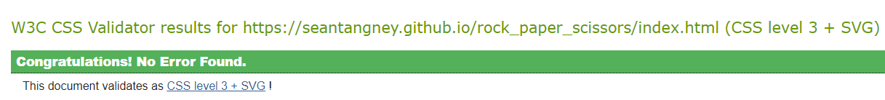

# Rock Paper Scissors

## Link to the deployed site

[Link to the deployed site](https://seantangney.github.io/rock_paper_scissors/index.html)

## Some pictures of the finished site
### Landing page

### Game Page

### Screenshots from my Iphone 11
 

# User Experience (UX)
- First time visitor Goals
    - As a first time visitor, I want to instantly understand the purpose of the site.
    - As a first time visitor, I want to be able to easily navigate through the site.
    - As a first time visitor, I want the game to be fun.

- Returning / Frequent user goals
    - As a returning / frequent user, I want to be able to come back and play again.

## Target Audience
Rock Paper Scissors is a classic game and this site is made for everyone, to have fun!

## The features i wanted my project to have are

- Create a username
- Scoretracking system
- Provide feedback to the user after input
- Provide feedback on the result of the game
- Easy to navigate
- Feel fun to be on the site through colour and interactivity

# Design
## Color Scheme
- The main colors i used were pink, yellow and light blue for the Font Awesome icons. I chose these "Pastel" inspired colours because i knew they would look nice with a text-shadow ( Neon) effect when hovered over them. I used Coolers to help me to generate this color pallette.

## Fonts
- The primary font used was Fuzzy Bubbles with a fallback of Garamond in case the fonnt isn't imported into the site correctly. Fuzzy Bubbles is an attractive, fun font.

## Imagery
- I chose to use font awesome icons instead of images in this site as i feel like icons are more suited to the nature of this game. 

## Wireframes
### Landing page

### Game Page

# Features

### Responsive on All Devices - I used am i responsive to check this along with checking on a variety of devices myself.

## Has interactive features
### Landing Page
-   Username is required to be able to use the Lets play button.
-   The Lets play button has a hover feature where it inverts its colours.
### Game Page
-   The colorful Rock, Paper and scissors icons on the bottom of the page have a hover effect which will display them as glowing neon icons. I found this great tutorial on [CSS Tricks](https://css-tricks.com/how-to-create-neon-text-with-css/) 
-   The scoreboard updates live to the current score of the game as you play.
-   When rock paper or scissors is selected, you get feedback on what the computer/robot has selected too. This happens in two form, the robots selected icon will light up for 2 seconds and turn off again. There will be a little written description of what you picked and what the robot picked and the result of that round.
- There is a home button on the top left corner of the header to take you back to the landing page. This also lightly glows as you hover over it staying consistent with the rest of the site.
- I have a fun cursor follower animation for the game page. It adds to the "game feel". I found this cool animation on [CodePen](https://codepen.io/morphed/pen/LZWppE).

# Technolies Used
## Languages Used
- HTML5
- CSS3
- Javascript

## Frameworks, Libraries and Programs Used

- [Bootstrap](https://getbootstrap.com/docs/4.4/getting-started/introduction/) 
    - Bootstrap was used to assist with the responsiveness and styling of the website.

- [Hover.css](https://ianlunn.github.io/Hover/)
    - Hover was used multiple times throughout the site to add a fun feeling to the game and offer more site feedback to the user.

- [Google Fonts](https://fonts.google.com/)
    - Google fonts was used on this site to import the font 'Fuzzy Bubbles'.

- [Font Awesome](https://fontawesome.com/)
    - Font awesome was used on this site for the game icons and the home button.

- [Git](https://git-scm.com/)
    - Git was used for version control by utilizing the Gitpod terminal to commit to Git and push to Github.

- [GitHub](https://github.com/)
    - Github is used to store project's code after being pushed from git.

- [Balsamiq](https://balsamiq.com/)
    - Balsamiq was used to create my wireframes in the planning and design process.

## Testing
- I used [W3C Markup Validator](https://validator.w3.org/) to validate my html. It returned no errors.  \

- I used [W3 Jigsaw](https://jigsaw.w3.org/css-validator/#validate_by_uri) to validate my Css. It returned no errors.  \

- I used Lighthouse in developer tools to test my site. This was the result i got

# Further Testing

- I have tested the website on Google Chrome, Internet Explorer, Firefox, Safari and Edge.
- I have tested to make sure the websites navigation is working correctly.
- The website was tested on Iphone 8, X and 11 pro, Ipad, Macbook Air and Desktop by me.
- I sent the site link to friends and asked them to test it out and play the game so they could let me know any issues they encountered, how the game felt to play and if navigation and ease of use was all okay.

# Testing the User Stories from the User Experience (UX) Section
## First Time Visitor Goals
1. As a first time visitor, I want to instantly understand the purpose of the site.
    - When first entering the site you instantly know that its a game by the big Lets PLay button. You are given instructions on how to play the game and you are made familiar with the game icons.

2. As a first time visitor, I want to be able to easily navigate through the site.
    - The site is easily navigated through. If a user presses the lets play button without entering a username they are subtly prompted to do so my means of adding a red margin around the username box. 
    - When on the game page, if a user would like to return to the landing page to change their username, there is a Home icon on the top left corner of the screen.

3. As a first time visitor, I want the game to be fun.
    - I think there is a nostalgic feel to this game for everyone. It's not a strategic game but a game of chance, so you never know that the result is going to be! It is a fun game to play. Even to move your mouse around and hover over the icons is fun.

## Returning / Frequent User Goals

2. As a returning / frequent user, I want to be able to come back and play again.
    - This is an easy one to acheive as the site is live. I think for the returning user in the future there could be added levels of difficulty to the game.

# Bugs
## Resolved

## Unresolved

# Deployment
## Github Pages
The project was deployed to GitHub using the following steps

1. Log in to GitHub and locate the GitHub Repository.
2. At the top of the Repository (not top of page) locate "Settings" on the menu.
3. Scroll down the settings page until you see the "GitHub Pages" section.
4. Under "Source", click the dropdown menu called "None" and select "Master Branch".
5. The page wil automatically refresh.
6. Scroll back down through the page to locate the now published site link in the 

### Forking the GitHub Repository
#### When you fork the GitHub Repository you make a copy of the original repository on you GitHub account to view and/or edit without affecting the original repository by using the following steps:

1. Log into GitHub and locate the Github Repository.
2. At the top of the Repository (not the top of the page) just above Settings on the menu, locate the "Fork" Button.
You should now have a copy of the original repository in your GitHub account.

### Making a Local Clone

1. Log into Github, locate the GitHub Repository.
2. Click on "Clone or Download".
3. To clone the repository using HTTPS, under " Clone with HTTPS, copy the link.
4. Open Git Bash.
5. Change the current working directory to the location where you want the cloned directory to be made. 
6. Type "Git Clone", and then paste the url you copied in step 3.
7. Press enter, your local clone will be created.

# Features I Would Like To Implement
- I would like to add levels of difficulty. This would mean Easy is as the game is now. Hard would be adding in Lizard and Spock to the game.

# Credits
## Code
- I used [Stack Overflow](https://stackoverflow.com/) and [W3 Schools](https://www.w3schools.com/html/default.asp) was used throughout the project to help with syntax issues. 
- All Code was written by the developer.

## Content
- [Coolers](https://coolors.co/) Was used to select the colour scheme i used.
- Principles learned from [Code Institute](https://codeinstitute.net/ie/) were used on this site.
- Scoreboard design was learned from a [FreeCodeCamp](https://www.youtube.com/watch?v=jaVNP3nIAv0&list=PLql9CSyGIEduO5YpWS1TO06ekT5NfGxYG&index=8&ab_channel=freeCodeCamp.org) Youtube Tutorial.
- Mouse animation was learned from [Codepen](https://codepen.io/morphed/pen/LZWppE).

## Media
- All icons used were from [FontAwesome](https://fontawesome.com/)

# Aknowlegements 
1. Tutor support at Code Institute for their help and guidance.
2. My Mentor for continuous helpful feedback.